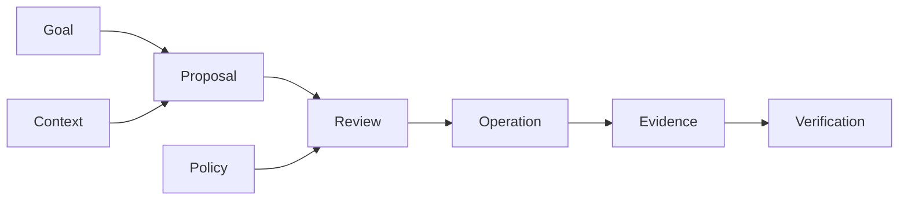

# TrashPal

TrashPal is an executable full-stack reference application for connected raccoon homes. A member manages one **Palace** from its workspace, where **Pal** prepares proposals, runs already-approved automations within saved limits, and asks for a new decision when the request exceeds those limits.

Connected-home writes become dangerous when the device accepts a request but the response is lost.
A blind retry can create a duplicate routine; assuming failure can lie about the home's state.
TrashPal carries one operation identity through approval, execution, reconciliation, and
verification so that uncertainty remains visible until evidence closes it.

The application, not Pal, owns approval, durable execution, recovery, and verification. A request, approval, or operation is not shown as verified until durable evidence supports that result.

The default executable path uses deterministic fixtures and simulated connected-home devices. The SmartThings adapter is implemented, but it has not been verified against live hardware. Rocky is the seeded member in sample data, not a product mode or a separate audience.

## What runs

| Concern          | Boundary                                                                                            |
| ---------------- | --------------------------------------------------------------------------------------------------- |
| Palace workspace | A tenant-scoped web control surface with server-derived local-time presentation                     |
| Pal              | A bounded harness with host-owned tools, budgets, evidence, and policy checks                       |
| Member control   | Exact proposal approval bound to protected resource versions                                        |
| Reliability      | Idempotent operations, lease fencing, unknown-outcome reconciliation, and verifier-owned completion |
| Shared knowledge | One hash-pinned Help corpus, claim registry, and learning graph for people and agents               |
| Interfaces       | Typed HTTP and MCP projections over the same application services                                   |
| Evidence         | Correlated product evidence and approval-gated PostHog export                                       |



Diagram: A member goal and current context produce a proposal. Policy and a member decision authorize an operation. Evidence and a verifier then determine whether its outcome is known. This sequence describes the control path; it does not prove that a device action succeeded.

## Run the local product

With Docker running, install the pinned dependencies and start PostgreSQL, the web application,
gateway simulator, and Pal worker:

```bash
pnpm install --frozen-lockfile
pnpm local:up
```

Open [TrashPal on loopback](http://127.0.0.1:3300). The command generates ignored local secrets, waits for every service to become healthy, and uses deterministic fixtures rather than paid models or live devices. Use `pnpm local:down` when finished.

## Verify the repository

Run the credential-free quality gate from the repository root:

```bash
pnpm check
```

The repository includes a Next.js product, PostgreSQL persistence, HTTP and MCP interfaces, a bounded Pal harness, deterministic and model-promotion evaluations, provider connectors, sanitized observability evidence, and one versioned knowledge system for people and agents.

## Learn and maintain

- [Help](knowledge/): start using TrashPal, manage automations, troubleshoot, understand Pal, developer docs, and API/MCP reference.
- [Maintainer documentation](docs/README.md): architecture decisions, security, evaluation, and operations.
- [Executable contract guide](knowledge/resources/executable-contracts.md): how to inspect API and MCP artifacts derived from typed owners.
