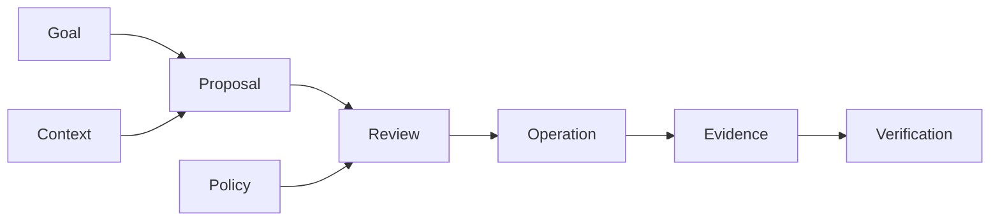

# TrashPal

TrashPal is a full-stack reference SaaS for connected raccoon homes. Each tenant operates one **Palace** from its Palace workspace. **Pal** is a bounded agent: it prepares proposals, runs already-approved automations inside saved limits, and asks a member when it needs a new decision.

The application, not Pal, owns approval, durable execution, recovery, and verification. A request, approval, or operation is never shown as a verified result until durable evidence supports that claim.

Rocky is the seeded member in the sample data. He is not a product mode or a separate audience.

This is an independent fictional project, not an official PostHog product. The default executable path uses simulated connected-home devices. The SmartThings adapter is implemented but remains unverified against live hardware.

## What runs

| Concern          | Boundary                                                                                            |
| ---------------- | --------------------------------------------------------------------------------------------------- |
| Palace workspace | A tenant-scoped web control surface with server-derived local-time presentation                     |
| Pal              | A bounded harness with host-owned tools, budgets, evidence, and policy checks                       |
| Member control   | Exact proposal approval bound to protected resource versions                                        |
| Reliability      | Idempotent operations, lease fencing, unknown-outcome reconciliation, and verifier-owned completion |
| Shared knowledge | One hash-pinned Help corpus, claim registry, and learning graph for people and agents               |
| Interfaces       | Typed HTTP and MCP projections over the same application services                                   |
| Evidence         | Correlated product evidence and approval-gated PostHog export                                       |



## Run the local product

With the pinned dependencies installed and Docker running, one command builds and starts PostgreSQL, the web application, gateway simulator, and Pal worker:

```bash
pnpm local:up
```

Open [TrashPal on loopback](http://127.0.0.1:3300). The command generates ignored local secrets, waits for every service to become healthy, and uses deterministic fixtures rather than paid models or live devices. Use `pnpm local:down` when finished.

## Verify the repository

Run the credential-free quality gate from the repository root:

```bash
pnpm install --frozen-lockfile
pnpm check
```

The repository includes a Next.js product, PostgreSQL persistence, HTTP and MCP interfaces, a bounded Pal harness, deterministic and model-promotion evaluations, provider connectors, PostHog-shaped evidence, and one versioned knowledge system for people and agents.

## Learn and maintain

- [Help](knowledge/): start using TrashPal, manage automations, troubleshoot, understand Pal, developer docs, and API/MCP reference.
- [Maintainer documentation](docs/README.md): architecture decisions, security, evaluation, and operations.
- [Executable contract guide](knowledge/resources/executable-contracts.md): how to inspect API and MCP artifacts derived from typed owners.
