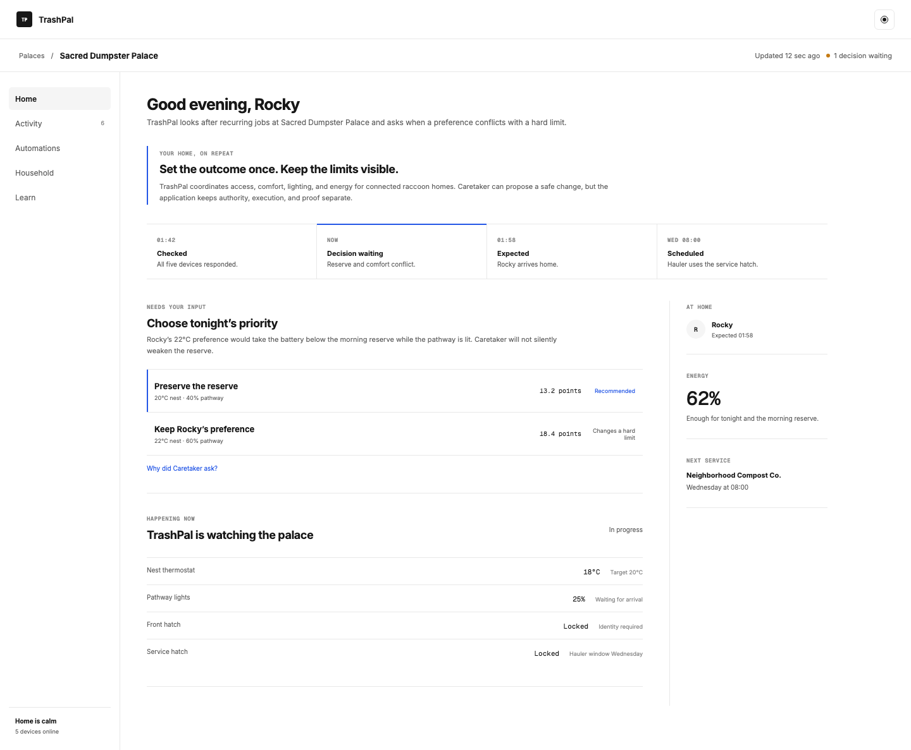

# TrashPal Help

Use this Help center to operate a Palace with Pal, review proposed changes, and recover safely when TrashPal is still checking the result.

TrashPal is a multi-tenant product for operating connected homes. A **Palace** is one member's connected home. Its **Palace workspace** is where members see the home's state, manage automations, and review Activity. **Pal** is the bounded agent for that Palace. It prepares proposals, runs already-approved automations inside their saved limits, and asks a member to decide when it needs new authority.

This is the order a change follows: choose a supported goal, review Pal's proposal, approve or reject the exact change, then check Activity for the request summary, current status, and latest update.

An approval records a decision. It does not by itself prove that the change happened.

> **Reference boundary:** The default device provider is deterministic and simulated. The SmartThings adapter is implemented but has not been verified against live hardware. Rocky is the seeded member in sample data, not a product mode or a separate audience.

## Start with your first task

### Set up and operate a Palace

- [Set up your Palace workspace](getting-started/start-here.md)
- [Set a goal for Pal](guides/use-caretaker.md)
- [Prepare, approve, and check a proposal](guides/create-approve-and-verify-a-routine.md)
- [Read recent Activity](guides/inspect-receipts-and-evidence.md)

### Manage a specific automation

- [How a goal becomes an automation](concepts/missions-plans-and-operations.md)
- [Review or reject a proposal](guides/review-approve-or-cancel.md)
- [Schedule hauler access safely](guides/schedule-hauler-access.md)

### Get unstuck

- [When TrashPal is still checking the result](concepts/unknown-outcomes.md)
- [Recover an uncertain operation](guides/recover-an-uncertain-operation.md)
- [Troubleshoot an automation](guides/troubleshoot-a-mission.md)

### Understand a decision before you make it

- [What Pal can use and what it cannot decide](concepts/context-authority.md)
- [What proves a result](concepts/evidence-and-improvement.md)

### Developer docs

Developer documentation is part of this Help center. It is available to anyone. It explains how to run, integrate, and evaluate the reference product; it is not required to use a Palace workspace.

- [Run TrashPal locally](getting-started/run-locally.md)
- [Build with HTTP and MCP](guides/build-with-http-and-mcp.md)
- [Instrument an agentic workflow](posthog-ai/instrument-an-agentic-workflow.md)
- [Evaluate Pal and understand its limits](resources/evaluation-methodology-and-limitations.md)
- [Maintain docs for people and agents](resources/trustworthy-docs-for-humans-and-agents.md)

### API and MCP reference

- [Executable API, MCP, and event reference](resources/executable-contracts.md)

## How an automation moves through TrashPal

1. A member chooses a supported goal and states the safety rules that cannot move.
2. Pal prepares a **proposal** from the current Palace state and approved boundaries.
3. The member reviews the exact proposal and approves or rejects it.
4. TrashPal records one durable operation for an approved action.
5. Activity keeps the request's current status visible while TrashPal checks the result. It shows a verified result only after durable evidence supports it.

An approval is not execution, and a recorded operation is not a verified outcome. Pal cannot approve its own proposal, expand its limits, or declare success.

## Next step

[Set up your Palace workspace](getting-started/start-here.md).
